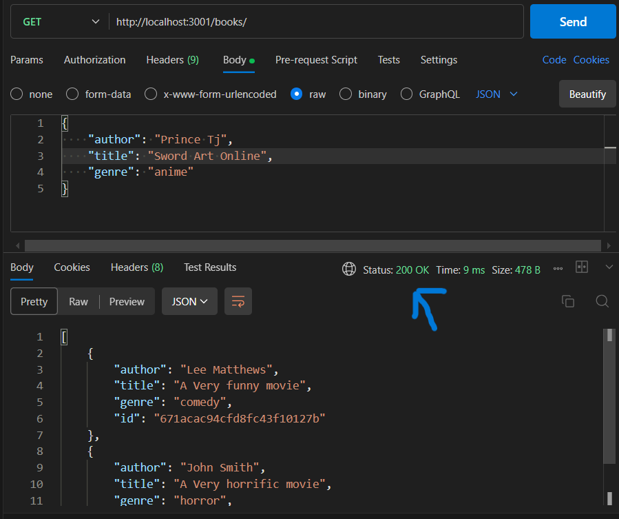
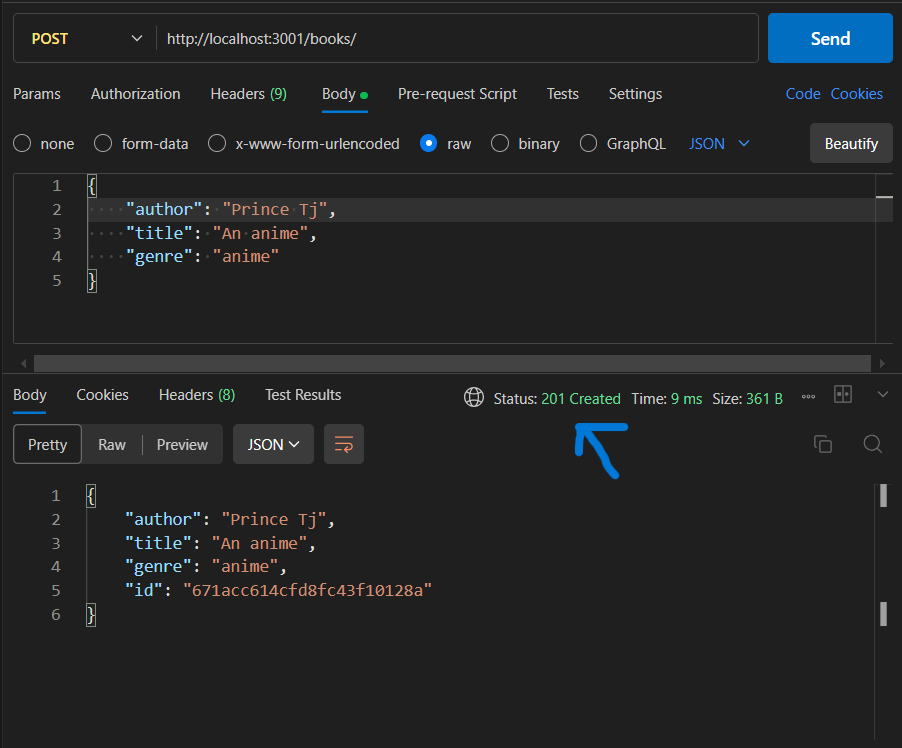

## BOOKSTORE REST API

This is a solution for Hack51 backend bookstore challenge

# TABLE OF CONTENT

- [Overview](#overview)
  - [Challenge](#challenge)
  - [Endpoints](#endpounts)
- [My Process](#my-process)
  - [Built With](#built-with)
  - [Requirements](#requirements)
  - [Test](#test)
- [API ENDPOINT EXAMPLES](#api-endpoint-examples)
- [Author](#author)

# Overview

# Challenge

- Create a REST API using a framework like Node.js (Express), Pyhon (Flask/Django), or any other backend framework
- Implement the following endpoints

# Endpoints

- [GET /books](#get-/books)
  - retrieves a list of all the books
- [POST /books](#post /books)
  - Add a new book to the collection
- [PUT /books/:id](#put-/books/:id)
  -Update an existing book's information
- [DELETE /books/:id](#delete=/books/:id)
  - Delete a book by it ID

# My Process

# Built With

- Express Node Framework

# Requirements

- First git clone the repository

  -

  ```
      git clone https://github.com/iamprincetj/book-store-api.git
  ```

- Install dependencies

  -

  ```
  npm install
  ```

- Make sure you have a MongoDB server locally

  - Then add the MONGODB_URL environmental variable in the .env, remember to add .env to .gitignore

  - Add the PORT environmental variable in the .env also

- Run npm run dev for development
- Run npm start for production

# API ENDPOINT EXAMPLE

# GET /books

- GET request to http://localhost:3001/books
  - Returns a list of books

### Screenshot



# POST /books

- POST request to http://localhost:3001/books with data:

```js

    {
        "author": "Jerry Mcguire",
        "title": "American Pie",
        "genre": "comedy"
    }

```

- Response with a newly added book

### Screenshot



# PUT /books/:id

- PUT request to http://localhost:3001/1 with data:

```js

    {
        "author": "Jame nobfly",
        "title": "Your Lie in April",
        "genre": "anime"
    }

```

- Response with an updated book with id 1

### Screenshot


# DELETE /books/:id

- DELETE request to http://localhost:3001/1:

- Response with a status of 204

### Screenshot


# Test

- Go to test directory to see Tests
  - Run npm run test

# Author

- Frontend Mentor - [@iamprincetj](https://www.frontendmentor.io/profile/iamprincetj)
- Twitter - [@Iam_princeTj](https://x.com/Iam_princetj)
